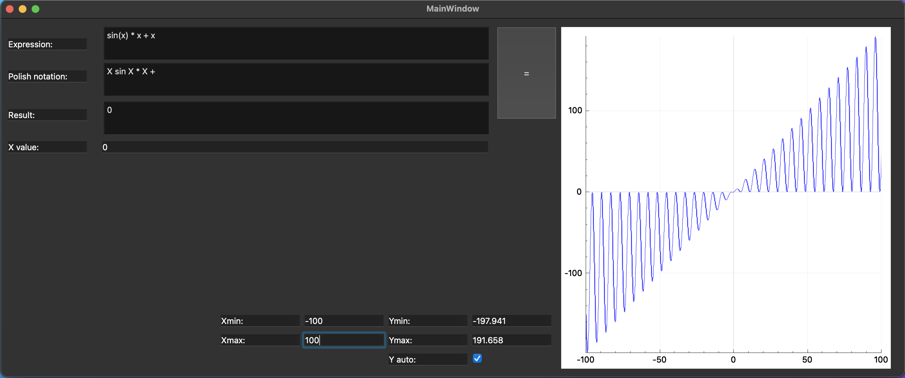
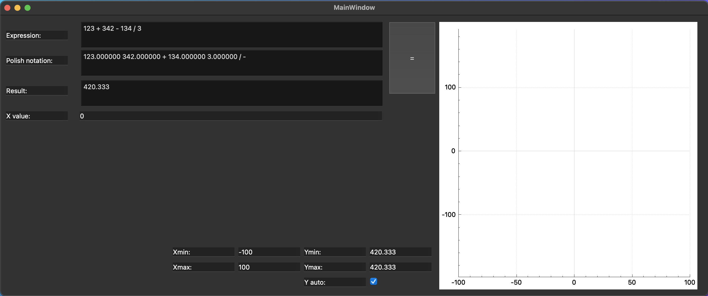

# SmartCalc

## Contents

0. [Description](#description)
1. [Screenshots](#screenshots)
2. [How to run](#how-to-run)
3. [Contacts](#contacts)

## Description

A simple implementation of a calculator program, developed with QT framework in C/C++ language.

Features: 
 - Converting mathematical expression to reverse polish notation
 - Graph plotting of function y(x) (Created with [QCustomPlot](www.qcustomplot.com) library)

Application was fully tested on MacOs Big Sur, backend additionally tested in Ubuntu Server 20.04

Project was developed by a student of School 21 as an implementation of School 21's project task.

## Screenshots

## How to run

To build program in **src** folder run: \
`` make install `` \
it will build a program to **build** directory. Please notice that in order to build project you must have QT, Cmake and C/C++ compatible compiler (gcc is recommended) installed.   

All default GNU Make stages are supported. Also this stages are available:
 - ``test`` Build and run internal tests. (Requirements: Check.h library)
 - ``gcov_report`` Same as **test**, but also generates gcov report, with line coverage data. (Requirements: Check.h library, lcov tool)
 - ``check`` Performs code style tests using clang-format tool (Requirements: clang-format tool), leaks test on internal tests

To export documentation to html and latex run: \
`` make dvi `` \
Doxygen tool is required. Resulting documentation can be found in **documentation** directory.

## Contacts

With any questions/suggestions/other contact  
 - Mail: [ivo-pronin@yandex.ru](mailto:ivo-pronin@yandex.ru).